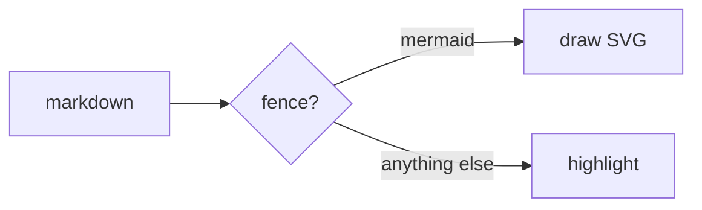

# slide

A markdown file in, a static slideshow out.

Every slide is its own page with its own URL, moving between them is a real
browser navigation, and the next slide is already prerendered when you get
there. There is no client-side router, no framework, and nothing to boot: a
built deck is HTML, one shared script and one shared stylesheet.

```sh
slide init talk.md      # a deck to start from
slide dev talk.md       # edit it, with live reload
slide build talk.md     # write a static site to dist/
```

**[Documentation](https://pridont.github.io/slide/)** · [a built deck](https://pridont.github.io/slide/demo/) · [a project of several](https://pridont.github.io/slide/talks/)

## Install

```sh
curl -fsSL https://pridont.github.io/slide/install.sh | sh
```

It resolves the latest release, downloads the npm tarball attached to it, and
installs that globally. npm on its own does the same thing:

```sh
npm install -g https://github.com/pridont/slide/releases/latest/download/slide.tgz
```

Node 20 or newer. A deck kept in a repository is usually better off with the
CLI pinned beside it — `npm install -D <the same URL>` — so it still builds in
a year. [Installation](https://pridont.github.io/slide/install/) has the rest:
pinning a version, building from source, and the two optional packages a deck
with diagrams needs.

## Writing a deck

A deck is one markdown file. A line of exactly `---`, with a blank line above
it, starts the next slide:

```md
# The first slide

Some prose.

---

# The second
```

The blank line is what keeps a setext heading (`Title` over `---`) from
becoming a slide break. Four dashes or more is a thematic break, and a `---`
inside a code fence or an HTML comment is content, never a separator.

### Frontmatter

A YAML block at the top of the file configures the deck, and doubles as the
first slide's own frontmatter. A block straight after a separator configures
the slide that follows it.

| Deck key | What it does |
| --- | --- |
| `title` | document title, and the fallback slide title |
| `description` | `<meta name=description>`, and the text on a project's index card |
| `slug` | the deck's URL in a project; defaults to its path under `slides/` |
| `aspectRatio` | `16/9`, `4:3`, anything CSS accepts |
| `colorScheme` | `dark` or `light` |
| `theme` | design-token overrides — see [Theming](#theming) |
| `fonts` | font files the deck ships — see [Fonts](#fonts) |

| Slide key | What it does |
| --- | --- |
| `layout` | one of the layouts below, or one of your own |
| `class` | extra classes on the slide element, e.g. `theme-lilac` |
| `background` | a CSS colour, or an image reference |
| `image` / `imageAlt` | the picture an `image-left` / `image-right` slide is built around |
| `notes` | speaker notes, if you would rather not use a comment |

A frontmatter block has to be contiguous — a blank line ends it — and has to
contain at least one key that means something. That is what stops prose which
happens to look like YAML from being eaten. A block of nothing but typos is an
error with a suggestion, not a silently ignored slide.

Speaker notes are an HTML comment at the end of a slide:

```md
# A slide

<!-- Only the presenter sees this. -->
```

### Layouts

```md
---
layout: two-cols
---
```

| Layout | For |
| --- | --- |
| `default` | anything |
| `cover` | a title slide |
| `center` | one thing, in the middle |
| `section` | a divider between parts of a talk |
| `quote` | a pull quote, with whatever follows as the attribution |
| `two-cols` | two columns, split at `::: right` |
| `image-left` / `image-right` | a picture on one side, bleeding to the frame |
| `full-image` | words over the slide's `background:` image, with a scrim |

`::: right` splits a two-column slide. It needs no closing fence — an
unterminated container runs to the end of the slide — but you can close it with
`:::` and carry on in the first column:

```md
---
layout: two-cols
---

## Left

::: right

## Right
```

### Embeds

An interactive piece is its own little web page in an iframe:

```md
::: iframe {src=./demo/ aspect=16:9}
An optional caption.
:::
```

`src` is a file or a directory served from its `index.html` — a directory is
what lets an embed have its own stylesheet and scripts, and it is copied whole,
so the relative links inside it keep working. Keys: `src`, `title`, `aspect`
(`16/9`, `4/3`, `3/2`, `1/1`), `height` in pixels, `sandbox`, `loading`.

Embeds are sandboxed to `allow-scripts` unless you widen it
(`sandbox="allow-scripts allow-forms"`) or turn it off (`sandbox=off`), and
they stay empty until the slide is actually reached, so a prerendered demo is
not running behind your back.

### Diagrams

A ` ```mermaid ` fence becomes a picture:

````md

````

The diagram is drawn while the deck is built and inlined as SVG, so **nothing
about mermaid reaches the browser** — no script to download, nothing to paint
late, and the picture is there in the first frame like any other markup.
Shipping mermaid instead would add roughly 400 kB over the wire to every slide
carrying a diagram, against a whole-deck payload of about 6 kB.

Colours come from the deck's own tokens, so a diagram follows `theme:` the way
everything else does — change `colorAccent` and the boxes change with it. The
accent trio is the categorical series a pie or a class diagram cycles through.

Drawing needs a browser, because mermaid measures its text through the DOM.
Both pieces are optional, and only a deck with a diagram in it needs either:

```sh
pnpm add -D mermaid playwright && pnpm exec playwright install chromium
```

A deck that has a fence and neither installed gets an error saying so, rather
than a diagram that quietly renders differently somewhere else.

Every diagram is cached on disk by its source and the deck's resolved palette,
under `node_modules/.cache/slide`. A rebuild that changed no diagram never
launches anything; a first build of six diagrams costs about a third of a
second in total.

Two things worth knowing:

- **A diagram is measured in the font the build can see.** If your deck ships
  its own faces with `fonts:`, they are loaded for the measurement too and it
  matches. On the default system stack the build machine's fonts and your
  audience's may differ slightly, which shows up as roomier or tighter boxes.
- **Per-slide accents do not reach a diagram.** `class: theme-lilac` recolours
  the slide around it, but the picture's colours were baked when it was drawn,
  from the deck's palette.

## Theming

The default theme reads its values from tokens, and `theme:` overrides any of
them. Names are the CSS custom properties without the `--slide-` prefix, in
either spelling:

```yaml
---
colorScheme: light
theme:
  colorAccent: "#ff8800"
  fontBody: Georgia, serif
  fontSize: 2.4 # percent of the slide's width
---
```

A mistyped token is an error with a did-you-mean, so it cannot quietly do
nothing. There are 60 of them: `color-*` for the palette, `syn-*` for syntax
highlighting, `font-*`, `fs-*` and `lh-*` for type, and `padding`, `gap`,
`radius-*` and `transition-*` for the rest.

Three accents come with the theme. A slide picks one with
`class: theme-apricot | theme-lilac | theme-cyan`.

Type and spacing are expressed in `cqw` against the slide's own size container,
so a deck looks identical on a laptop and a projector with no measuring script.

### Fonts

The theme names system faces, so a deck costs no font requests at all. To ship
your own:

```yaml
---
fonts:
  Inter: ./fonts/inter.woff2
  IBM Plex Mono:
    - src: ./fonts/plex-400.woff2
    - src: ./fonts/plex-700.woff2
      weight: 700
theme:
  fontBody: Inter, sans-serif
---
```

The files go through the asset pipeline like any other reference, and the
`@font-face` rules are generated for you. Declaring a family loads it; pointing
a token at it is what uses it.

## Projects

Point the CLI at a directory and every deck in it is built together, sharing
one runtime and one stylesheet, with an index page listing them:

```
talks/
  slide.config.ts
  theme.css
  layouts/
    card.html
  slides/
    intro.md              ->  /intro/
    2026/
      view-transitions.md ->  /2026/view-transitions/
```

A `slides/` directory, when there is one, is the authoritative answer and is
walked recursively. Without one, only top-level markdown counts, so a `notes/`
folder never quietly joins the build.

```ts
import type { ProjectConfig } from 'slide'

export default {
  title: 'Talks',
  description: 'Shown on the index page',

  // Defaults for every deck; a deck's own frontmatter wins.
  aspectRatio: '16/9',
  colorScheme: 'dark',
  theme: { colorAccent: '#e6a878' },
  fonts: { Inter: './fonts/inter.woff2' },

  // Order on the index page. Naming a deck here does not move its URL.
  decks: ['slides/intro.md', 'slides/2026/view-transitions.md'],

  // Stylesheets loaded after the theme.
  css: './theme.css',

  // Each <name>.html here becomes a layout a slide can ask for.
  layouts: './layouts',

  base: '/',
  outDir: 'dist',

  // Sizes in kB the build should complain past. 0 turns a check off.
  budget: { page: 100, asset: 1000 },
} satisfies ProjectConfig
```

`slide.config.ts`, `.mts`, `.js`, `.mjs` and `.json` all work; TypeScript needs
no build step of its own.

### Layouts of your own

Every `<name>.html` in the `layouts:` directory becomes a layout. A template
fills in `{{content}}`, `{{image}}`, `{{alt}}` and any region by name:

```html
<div class="slide-content card">
  <div class="card__panel">{{content}}</div>
</div>
```

The template supplies the inside of the slide; the `<main>` around it stays the
tool's, so backgrounds, the aspect ratio and `class:` keep working. A
placeholder that is not something a slide has is an error rather than an empty
space. Style it from a stylesheet listed in `css:` — a template is raw HTML,
and an inline `style` attribute is the one thing a strict CSP will block.

## Presenting

| Key | Does |
| --- | --- |
| <kbd>→</kbd> <kbd>↓</kbd> <kbd>space</kbd> <kbd>page down</kbd> <kbd>enter</kbd> | next slide |
| <kbd>←</kbd> <kbd>↑</kbd> <kbd>page up</kbd> <kbd>backspace</kbd> | previous slide |
| <kbd>home</kbd> <kbd>end</kbd> | first, last |
| <kbd>f</kbd> | fullscreen |
| <kbd>p</kbd> | presenter window |

On a touch screen, tapping the right two thirds advances and the left third
goes back. On a mouse it does not, because click-to-advance fights with
selecting text.

<kbd>p</kbd> opens `/<deck>/presenter/`: the current slide, the next one, your
notes, an elapsed timer you start by clicking it, and the wall clock. Both
frames are the real slide pages, so what you rehearse against is what the room
sees. The two windows follow each other over a `BroadcastChannel` — drive from
either, and a window that joins late catches up on its own.

## The CLI

```
slide dev <path> [options]      edit with live reload
slide build <path> [options]    write a static site
slide init [path]               write a deck to start from

--out <dir>    output directory (default: dist next to the input)
--base <path>  public base path (default: /)
--serve        serve the finished build and stay running (build only)
--port <n>     port for dev or --serve
--host <host>  host, e.g. 0.0.0.0 to reach it from a phone
--open         open a browser
--no-minify    leave the bundled runtime unminified (build only)
-v, --version
-h, --help
```

The dev server renders from memory at the same URLs the build writes, through
the same renderer, so a preview cannot drift from the output. It also measures
each slide in the browser and tells you when one loses content to the frame —
a slide is `overflow: hidden`, so too much on it is trimmed with no other
warning.

## What the build writes

```
dist/
  index.html                 project index, when there is more than one deck
  <deck>/index.html          slide 1
  <deck>/2/index.html        slide 2…n
  <deck>/presenter/index.html
  assets/runtime-<hash>.js   shared by every page of every deck
  assets/runtime-<hash>.css
  assets/<name>-<hash>.<ext> images, fonts, anything referenced
  embeds/<name>-<hash>/      directory embeds, copied whole
```

### Deploying

Everything hashed is immutable; the pages are not:

```
/assets/*   Cache-Control: public, max-age=31536000, immutable
/embeds/*   Cache-Control: public, max-age=31536000, immutable
*.html      Cache-Control: no-cache
```

The pages are the URLs a deck is linked by, so they want revalidation. A stale
page pointing at an asset that no longer exists is the failure worth avoiding.

### Content-Security-Policy

Nothing the build emits sets a policy, and the output works under a strict one:

```
Content-Security-Policy:
  default-src 'self';
  script-src  'self' 'inline-speculation-rules';
  style-src   'self';
  img-src     'self' data:;
  font-src    'self'
```

There is nothing to hash and nothing to allow, because there is no inline
script and no inline `style` attribute anywhere in a page: custom properties
that would have been inline styles are generated into a stylesheet instead, and
the one script that must run before the first render is an external
parser-blocking file.

`'inline-speculation-rules'` is the exception, and dropping it fails silently —
prerendering stops with no console warning. The alternative is a
`Speculation-Rules` response header, which needs server configuration a static
host may not offer.

## Browser support

Chrome gets cross-document view transitions and prerendering. Everywhere else
navigates plainly: no animation, nothing broken, same URLs. Nothing about a
deck depends on either.

## Development

```sh
pnpm install
pnpm check         # lint, typecheck, unit tests
pnpm test:e2e      # Playwright, against a real build
pnpm example:dev   # the example deck, in the dev server
pnpm example:project
pnpm docs:serve    # the documentation site, at localhost:4180
pnpm docs:site     # the same, with both demo decks built into it
```

`src/parse` splits and validates, `src/render` turns a slide into a page,
`src/build` emits the site, `src/dev` serves the same renderer from memory,
`src/runtime` is the browser code, and `src/client` holds the two standalone
scripts that are handed to a browser as text rather than imported.

`docs/` is the documentation site: markdown pages plus `nav.json`, built by
`scripts/build-docs.mjs` — markdown-it and highlight.js, which the tool already
depends on, and no framework. `.github/workflows/pages.yml` builds it along
with both demo decks and deploys the lot to GitHub Pages.

## Commits and releases

Commit messages follow [Conventional Commits](https://www.conventionalcommits.org):

```
feat(cli): add a --base flag
fix: keep the presenter clock running across a slide change
docs: explain the layout front matter
```

`feat` and `fix` are the two that show up in the changelog and move the version
— `feat` the minor, `fix` the patch, and a `!` after the type (`feat!:`) the
minor as well while the version is below 1.0. The rest (`docs`, `refactor`,
`test`, `chore`, `ci`, `build`, `style`, `perf`, `revert`) are release notes at
most. `commitlint.config.js` holds the rules; `.githooks/commit-msg` checks
them before a commit is written, and CI checks every commit on a pull request
plus its title, since a squash merge lands the title. `pnpm install` is what
points git at `.githooks/`; `pnpm run prepare` does it on its own.

Releasing is merging a pull request. `.github/workflows/release-please.yml`
keeps a **chore(main): release x.y.z** pull request open, holding the version
bump and the `CHANGELOG.md` entries for everything merged since the last
release. Merging it tags the commit, creates the GitHub release with those
notes, and calls `.github/workflows/release.yml`, which builds and attaches the
npm tarball `install.sh` downloads. Nothing is published to npm.

A tag pushed by hand (`git tag v0.2.0 && git push origin v0.2.0`) still runs
the second half on its own, which is the way back in if a release needs
re-cutting.
