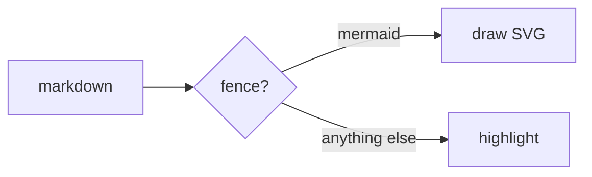

## A fence becomes a picture

````md

````

The diagram is drawn while the deck is built and inlined as SVG, so **nothing
about mermaid reaches the browser** — no script to download, nothing to paint
late, and the picture is there in the first frame like any other markup.

Shipping mermaid instead costs 27 requests and 189 kB over the wire — 805 kB
unpacked — the first time a slide with a diagram is opened, against 6.0 kB for
a whole deck without one. Prerendering would hide that for sequential
navigation and not at all for a link straight at a diagram slide, which is the
case a URL-addressable deck exists to serve.

That figure is what a browser actually fetches to draw one flowchart, not the
size of the package: mermaid loads its diagram types on demand, so the bundle
on disk says very little. `pnpm measure --mermaid` renders the flowchart above
in headless Chromium and counts the bytes.

## What it needs

Drawing needs a browser, because mermaid measures its text through the DOM.
Both pieces are optional peer dependencies, and only a deck with a diagram in
it needs either:

```sh
pnpm add -D mermaid playwright && pnpm exec playwright install chromium
```

A deck that has a fence and neither installed gets an error naming that line,
rather than a diagram that quietly renders differently somewhere else.

## Colours follow the deck

Colours come from the deck's own tokens, so a diagram follows `theme:` the way
everything else does — change `colorAccent` and the boxes change with it. The
accent trio is the categorical series a pie chart or a class diagram cycles
through.

```yaml
---
theme:
  colorAccent: '#79c6cf'
---
```

## Two things worth knowing

**A diagram is measured in the font the build can see.** If your deck ships its
own faces with [`fonts:`](./theming.md#fonts), they are loaded for the
measurement too and it matches. On the default system stack the build machine's
fonts and your audience's may differ slightly, which shows up as roomier or
tighter boxes.

**Per-slide accents do not reach a diagram.** `class: theme-lilac` recolours the
slide around it, but the picture's colours were baked when it was drawn, from
the deck's palette.

## What it costs

Every diagram is cached on disk by its source, the resolved palette, the config
and the mermaid version, under `node_modules/.cache/slide`. A rebuild that
changed no diagram never launches anything; a deck with no diagrams never
touches any of this.

The example project is four decks, 26 slides and six diagrams. Building it,
best of three runs:

| | |
| --- | --- |
| From nothing, drawing all six | about 600 ms |
| Again, off the cache | about 225 ms — no browser is launched |
| The drawing itself | about 375 ms, or 60 ms a diagram |

The fear that stalls this approach is that driving a headless browser would
dominate a build. Measured, it does not — and it is measurable: `pnpm measure
--diagrams` is where those numbers come from. The very first build on a cold
machine pays another half-second or so for the browser binary itself, once.

What it buys is on the other side of the table: the 189 kB above, not
downloaded, on every slide with a picture on it.

## Seeing one

[The project demo](/talks/) has a deck of diagrams in it — flowchart, sequence,
state, pie — all drawn at build time, all coloured by the project's tokens.
