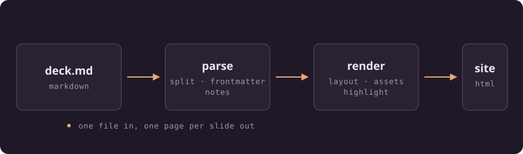

# Slide

## Markdown in, a static slideshow out

<!--
Deck frontmatter doubles as this slide's frontmatter, which is why the cover
layout and the background apply here. Everything after a `---` separator
configures the slide that follows it.
-->

---

#### The idea

## One file, one page per slide

A deck is a markdown file. Each slide becomes a real HTML page, so moving
between slides is a real navigation — which is what lets the browser do the
animation, preload the next page, and keep the URL honest.



<!-- The pipeline diagram is an ordinary markdown image. It gets content-hashed and copied into the build like any other asset. -->

---

#### Authoring

## Separators are just `---`

```md
# First slide

---

# Second slide
```

A separator is a line of exactly `---` with a blank line before it. That blank
line is doing real work: it keeps a setext heading from becoming a slide break.

---

#### Authoring

## Frontmatter configures a slide

```md
---
layout: cover
class: theme-lilac
background: ./cover.jpg
---
```

A block directly after a separator configures the slide that follows. The deck's
own frontmatter, at the top of the file, doubles as the first slide's.

---

#### Authoring

## The slide keys

| Key | What it does |
| --- | --- |
| `layout` | picks a layout preset |
| `class` | extra classes on the slide element |
| `background` | a CSS colour or an image reference |
| `notes` | speaker notes, instead of a comment |

---

#### Authoring

## The deck keys

| Key | What it does |
| --- | --- |
| `title` | document title and fallback slide title |
| `aspectRatio` | `16/9`, `4:3`, anything CSS accepts |
| `colorScheme` | `dark` or `light` |
| `theme` | design-token overrides |
| `fonts` | font files the deck ships |

---

#### Authoring

## Speaker notes live in a comment

```md
# The slide everyone sees

<!-- Only the presenter sees this bit. -->
```

A trailing HTML comment is lifted out of the slide body and kept as notes.
Presenter mode is where they surface.

<!-- Like this one. It never reaches the audience's screen. -->

---
class: theme-lilac
---

#### Design

## Everything is a token

```yaml
theme:
  colorAccent: "#e6a878"
  fontBody: Georgia, serif
  fontSize: 2.4 # percent of slide width
```

Type and spacing are expressed in `cqw` against the slide's own size container,
so a deck looks identical on a laptop and a projector. No measure-and-scale
script, and nothing to recompute on resize.

---

#### Design

## Fonts are yours to bring

The default theme names system faces, so a deck costs no font requests. Ship
your own and they go through the build like any other asset:

```yaml
fonts:
  Inter: ./fonts/inter.woff2
theme:
  fontBody: Inter, sans-serif
```

---
class: theme-cyan
---

#### Design

## Accents come in threes

Apricot is the default. A slide can switch with `class: theme-lilac` or
`class: theme-cyan` — this one is cyan.

- Links, list markers and rules follow the accent
- Syntax colours stay put, so code reads the same everywhere
- The whole palette flips with `colorScheme: light`

> Restraint is easier to keep when the theme has only three moves.

---

#### Code

## Highlighting happens at build time

```ts
export function renderSlidePage(options: RenderSlideOptions): string {
  const { html, title } = renderMarkdown(md, options.slide.body, resolveAsset)
  return renderPage({ ...options, main: applyLayout({ html, ...options }), title })
}
```

```bash
slide build talk.md --serve --open
```

None of the highlighter ships to the browser; the colours are `--slide-syn-*`.

---

#### Code

## A fence is never a separator

````md
```yaml
title: not frontmatter
---
still the same slide
```
````

The splitter tracks code fences and HTML comments, so a `---` inside either is
content. Four dashes or more is a thematic break, never a break in the deck.

---

#### Interactive

## Embeds are iframes with manners

::: iframe {src=./embeds/easing/ height=230 title="Easing comparison"}
`::: iframe {src=… }` frames a file or a whole directory.
:::

Sandboxed to `allow-scripts` unless you say otherwise, and the frame stays
empty until the slide is actually reached — a prerendered demo should not be
running behind your back.

---

#### Presenting

## Keys

| Key | Does |
| --- | --- |
| <kbd>→</kbd> <kbd>space</kbd> <kbd>page down</kbd> | next slide |
| <kbd>←</kbd> <kbd>page up</kbd> | previous slide |
| <kbd>home</kbd> <kbd>end</kbd> | first, last |
| <kbd>f</kbd> | fullscreen |
| <kbd>p</kbd> | presenter window |

On a touch screen, tapping the right two thirds advances and the left third
goes back. On a mouse it does not, because click-to-advance fights with
selecting text.

---

#### Presenting

## The presenter window

<kbd>p</kbd> opens `/presenter/` on your screen: the current slide, the next
one, your notes, and two clocks. Both frames are the real pages, so what you
rehearse against is what the room sees.

The two windows follow each other over a `BroadcastChannel` — drive from
either, and a window that joins late catches up on its own.

---

#### Under the hood

## The next slide is already loaded

```html
<script type="speculationrules">
  { "prerender": [{ "urls": ["/2/", "/4/"], "eagerness": "immediate" }] }
</script>
```

Both neighbours are prerendered, so the next slide is built and painted before
it is asked for. Browsers without speculation rules get `rel=prefetch` instead,
added by the runtime rather than the markup — so nothing fetches twice.

---

#### Under the hood

## Transitions belong to the browser

```css
@view-transition {
  navigation: auto;
}
```

That is the whole opt-in. Direction is worked out from the slide numbers in the
two URLs, so browser back and forward animate the right way too. Where
cross-document transitions are unsupported, pages simply navigate.

---

Setext headings survive
---

That title is underlined with `---`, which makes it a heading rather than a
separator. The rule is the blank line: a separator needs one before it, and a
setext underline sits directly under its text.

---
layout: cover
class: theme-lilac
---

# Thanks

## `pnpm example` builds and serves this deck

<!-- Last slide. Nothing prerenders past it, and `data-next` is absent, so the runtime knows there is nowhere to go. -->
