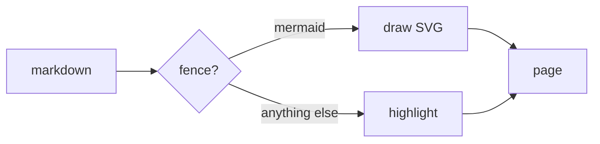
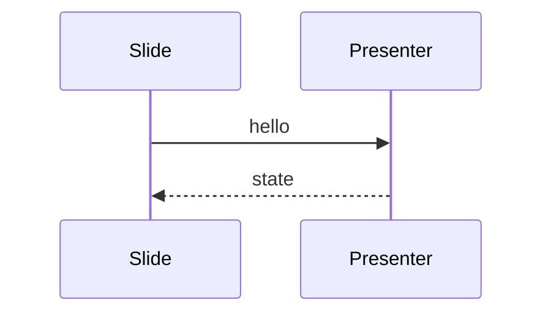
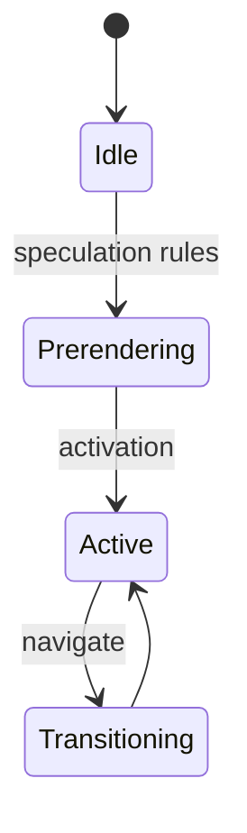
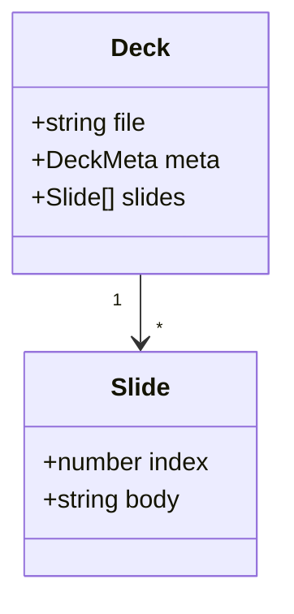
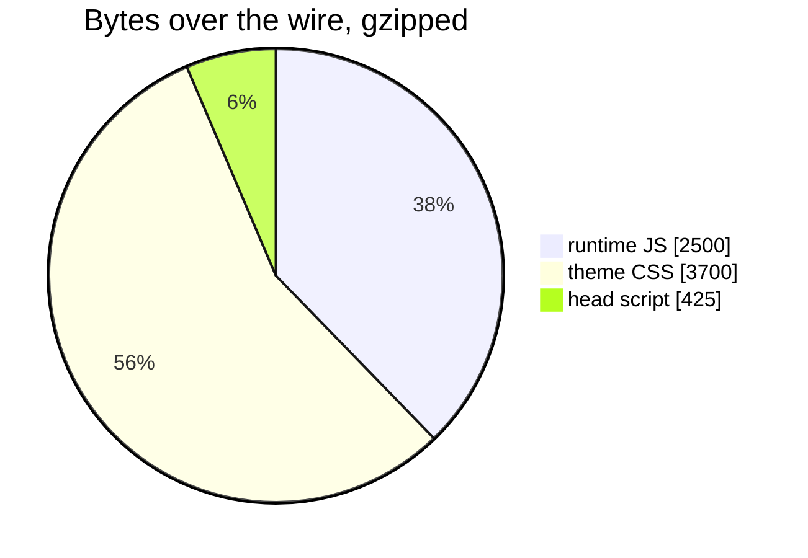

# Diagrams

## A ```` ```mermaid ```` fence becomes a picture

<!-- Nothing about mermaid reaches the browser. Every diagram here is SVG in the page, drawn while the deck was built. -->

---

## Flowchart



The colours are the deck's own tokens. Change `colorAccent` and the diagram
changes with it.

---
layout: two-cols
---

## Written as a fence

````markdown

````

Nothing else — no attributes, no configuration.

::: right


:::

---

## State



---
layout: center
---

## Class



---

## What it costs the audience



Mermaid itself is not in that list, and that is the whole point: it ran at
build time. Shipping it would have added roughly 400 kB to any slide carrying
a diagram.

<!-- The build needs mermaid and playwright installed to draw these. They are optional peers — a deck without a diagram never needs either. -->
